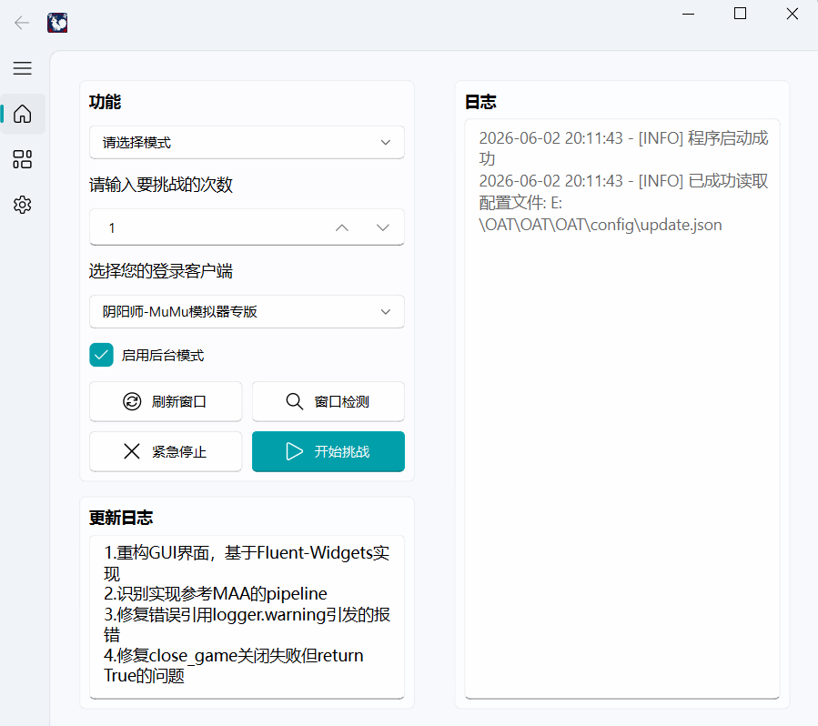
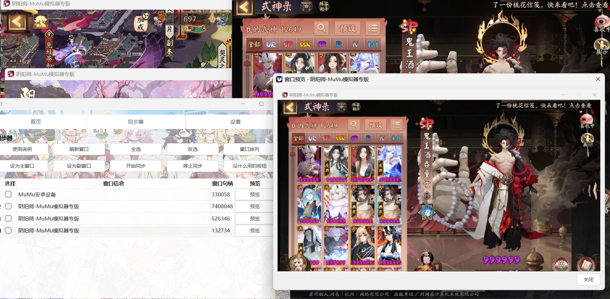

# OnmyojiAuto - 阴阳师自动化

<div align="center">
    
    
    
</div>


---

## 📥 程序下载 & 更新日志

| 功能              | 链接                                                                                         |
| ----------------- |:-------------------------------------------------------------------------------------------|
| 下载最新exe压缩包 | [立即下载](https://github.com/RMA-MUN/OnmyojiAuto/releases/download/OAT-v2.1.0/OAT-v2.1.0.zip) |
| 查看版本更新内容  | [前往查看](https://github.com/RMA-MUN/OnmyojiAuto/releases/latest)                             |

---

## 📸 程序截图

|                        运行截图                        |
| :----------------------------------------------------: |
|                       |
|                同步器和窗口预览功能展示                |
|  |
|                        背景图片                        |
|                 |

（可自行替换背景图片：将替换后的png图片命名为`background.png`即可覆盖）

---

## 📌 项目简介

OnmyojiAuto是一款基于Python开发的阴阳师游戏自动化辅助工具，通过计算机视觉技术实现游戏内的图像识别与自动点击，帮助玩家完成各类副本任务。工具支持多窗口同步操作，配备直观的GUI界面，降低使用门槛。

---

## ✨ 功能特性

- **🖥️ 多客户端支持**：兼容阴阳师桌面版与MuMu模拟器
- **🎯 丰富副本覆盖**：支持魂土、魂王、业原火、觉醒、爬塔（门票/体力）、灵染试炼、御灵、契灵探查等多种副本
- **🎨 便捷操作体验**：图形化界面（GUI）设计，支持模式选择、次数设置等可视化操作
- **🔄 多窗口协同**：支持桌面版窗口同步功能，可实现主窗口操作同步至副窗口
- **🎮 后台运行模式**：可选择后台运行，不占用鼠标和屏幕(后台运行仅支持桌面版)

---

## 🛠️ 源码运行步骤(需要python和git环境,非开发者不推荐)

### 1. 克隆仓库

```bash
git clone https://github.com/RMA-MUN/OnmyojiAuto.git
cd OnmyojiAuto
```

### 2. 安装依赖

使用项目提供的依赖清单安装所需库：

```bash
pip install -r requirements.txt
```

**依赖说明**：`opencv-python`（图像识别）、`PyQt6`（GUI界面）、`pywin32`（窗口控制）等。

### 3. 环境配置

- ✅ 推荐使用**阴阳师桌面版**([下载链接](https://adl.netease.com/d/g/a11/c/yx_yys))
- ✅ 确保程序以**管理员身份**运行
- ✅ 如不启用后台模式，请保证窗口可见

---

## 🚀 使用指南

### 基本操作

1. **启动程序**：
   
   ```bash
   python main.py
   ```
   
2. **配置客户端**：
    - 选择客户端类型（推荐阴阳师桌面版）
    - 如需自定义客户端，可在`client.json`中添加

3. **选择副本模式**：
   
    - 选择目标副本（如"魂土"、"爬塔"等）
    - 部分模式需选择子模式（如魂土的"队长"或"队员"）
    - 可在`OAT/source/mode.json`中添加和修改模式配置
    
4. **设置挑战参数**：

    - 设置挑战次数（1-10000次）
    - 点击"窗口检测"确认游戏窗口识别正常

5. **选择运行模式**：
    - 根据需求选择不同的客户端
    - 选择是否启用后台运行模式

6. **启动任务**：
    - 点击"开始挑战"启动自动化任务
    - 可通过"紧急停止"强行退出程序

---

## 🔄 多窗口同步功能

### 使用步骤

1. **刷新窗口**：点击"刷新窗口"按钮获取当前所有符合条件的窗口列表
    - 如需自定义窗口标题，可在`client.json`文件中配置

2. **选择窗口**：在表格中勾选需要参与同步的窗口

3. **设置主副窗口**：
    - 选择一个窗口并点击"设置主窗口"（作为操作源）
    - 选择一个或多个窗口并点击"设置副窗口"（跟随主窗口操作）

4. **窗口排列**：点击"窗口排列"按钮，系统会自动排列所有选择的窗口

5. **同步控制**：
    - 点击"开始同步"按钮启动同步功能
    - 点击"停止同步"按钮停止同步功能

### 注意事项

- ⚠️ 主窗口只能设置一个
- ⚠️ 副窗口至少设置一个
- ⚠️ 开始同步前请确保已正确设置主窗口和副窗口
- ⚠️ 同步过程中请勿关闭主窗口
- ⚠️ 如需调整同步窗口，建议先停止同步

---

## ⚠️ 注意事项

1. 📐 确保游戏窗口分辨率稳定，避免窗口缩放导致识别偏移
2. 💻 程序仅支持Windows操作系统(测试环境：1920*1080分辨率下，125%的缩放。)
3. 📝 本工具仅用于学习交流，如需对本程序进行修改，修改后的源代码必须采取GNU协议开源

---

## ❓ 常见问题

### Q: 窗口识别失败怎么办？
A: 如果窗口标题不匹配，可在`client.json`中修改窗口标题部分。

### Q: 图片识别错误如何解决？
A: 验证`source`目录下对应副本的图片资源是否匹配当前游戏版本，可重新截图替换并保持对应文件名。引起识别错误的原因可能是预设图片与实际使用图片不符或设备分辨率不同，建议自行截图替换。

### Q: 多窗口同步失效如何处理？
A: 确认主窗口和副窗口均已正确选择，主窗口需一直可见，副窗口可以最小化，但需确保主副窗口大小不变。

### Q: 窗口检测与执行挑战无效怎么办？
A: 确保本程序以管理员身份运行，确保窗口大小不变且可见。


---

<div align="center">
    <p>✨ 如还有问题或建议，欢迎提交 Issue ✨</p>
</div>

---

## 📜 许可证

本项目采用 [GNU General Public License v3.0](LICENSE) 开源，允许自由使用、修改和分发，但衍生作品必须以相同许可证开源。

---

## 📞 联系作者

- 📧 邮箱：n3032747608@163.com
- 🐧 QQ：3032747608
- 📦 GitHub：[RMA-MUN/OnmyojiAuto](https://github.com/RMA-MUN)