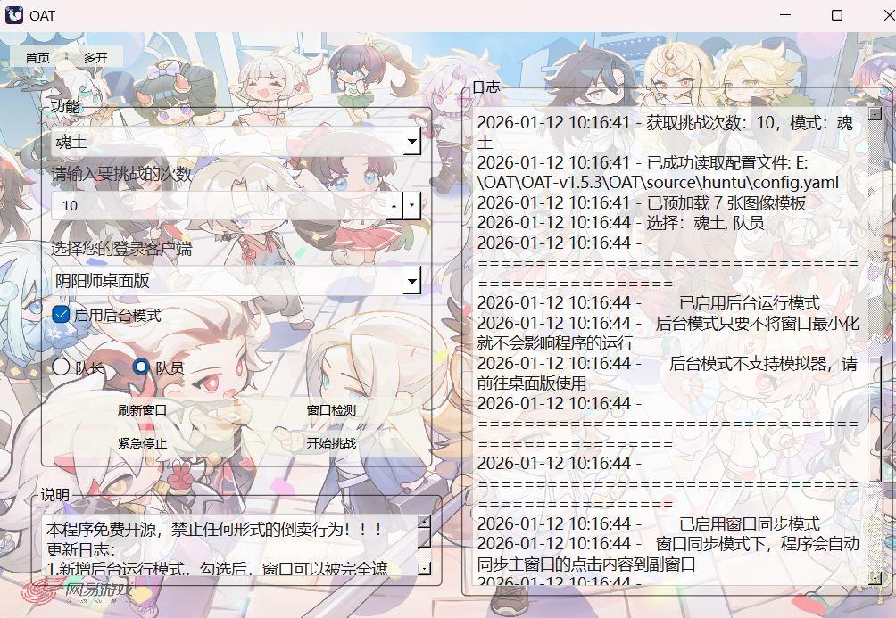

# OnmyojiAuto - 阴阳师自动化工具

程序背景图片
  
（可自行替换背景图片：将替换后的png图片图片命名为`background.png`即可覆盖)

程序运行主页截图



## 📌 项目简介
OnmyojiAuto是一款基于Python开发的阴阳师游戏自动化辅助工具，通过计算机视觉技术实现游戏内的图像识别与自动点击，帮助玩家高效完成各类副本任务。工具支持多窗口同步操作，配备直观的GUI界面，降低使用门槛。


## ✨ 功能特性
- **多客户端支持**：兼容阴阳师桌面版与MuMu模拟器
- **丰富副本覆盖**：支持魂土、魂王、业原火、觉醒、爬塔（门票/体力）、灵染试炼、御灵、契灵探查等多种副本
- **便捷操作体验**：图形化界面（GUI）设计，支持模式选择、次数设置等可视化操作
- **多窗口协同**：支持桌面版窗口同步功能，可实现主窗口操作同步至副窗口
  

## 🛠️ 安装步骤

### 直接下载exe程序的压缩包
[下载最新版本](https://github.com/RMA-MUN/OnmyojiAuto/releases/download/release/OAT-v1.5.3.zip)

### 1. 克隆仓库
```bash
git clone https://github.com/RMA-MUN/OnmyojiAuto.git
cd onmyoji-automation/OAT
```

### 2. 安装依赖
使用项目提供的依赖清单安装所需库：
```bash
pip install -r requirements.txt
```
依赖说明：`opencv-python`（图像识别）、`PyQt6`（GUI界面）、`pywin32`（窗口控制）等。

### 3. 环境配置
- 推荐使用**阴阳师桌面版**
- 确保程序以**管理员身份**运行
- 如不启用后台模式，请保证窗口可见
- 目前程序运行过程中已经不在占用鼠标


## 🚀 使用指南

### 基本操作
1. 启动程序：
   ```bash
   python main.py
   ```
2. 在GUI界面选择客户端类型，推荐使用阴阳师桌面版，如果需要其他客户端，可在client.yaml自行添加
3. 选择目标副本模式（如"魂土"、"爬塔"等），部分模式需额外选择子模式（如魂土的"队长"或"队员"）， 可在OAT/source/mode.json里自行添加和修改模式配置
4. 设置挑战次数（1-10000次）
5. 点击"窗口检测"确认游戏窗口识别正常
6. 根据需求选择不同的客户端和是否启用后台运行模式
7. 点击"开始挑战"启动自动化任务，可通过"紧急停止"强行退出程序


### 多窗口同步
1. 目前多开功能暂不可用，请使用其他多开器

2. 同步器使用步骤：

   ```python
   1. 刷新窗口：点击"刷新窗口"按钮获取当前所有符合条件的窗口列表，如果需要自定义窗口标题，可以在client.yaml文件里配置
   2. 选择窗口：在表格中勾选需要参与同步的窗口
   3. 设置主窗口：选择一个窗口并点击"设置主窗口"，主窗口将作为操作源
   4. 设置副窗口：选择一个或多个窗口并点击"设置副窗口"，这些窗口将跟随主窗口操作
   5. 排列窗口：点击"窗口排列"按钮，系统会自动排列所有选择的窗口
   6. 开始同步：点击"开始同步"按钮启动同步功能
   7. 停止同步：点击"停止同步"按钮停止同步功能
   
   注意事项：
   - 主窗口只能设置一个
   - 副窗口至少设置一个
   - 开始同步前请确保已正确设置主窗口和副窗口
   - 同步过程中请勿关闭主窗口
   - 如需调整同步窗口，建议先停止同步
   ```


## ⚠️ 注意事项
1. 确保游戏窗口分辨率稳定，避免窗口缩放导致识别偏移
2. 程序仅支持Windows操作系统
3. 本工具仅用于学习交流，请勿用于商业用途或违反游戏规定的行为


## ❓ 常见问题
- **窗口识别失败**：检查窗口标题是否正确（桌面版为"阴阳师-网易游戏"，模拟器为"MuMu安卓设备"，如果不是这两个客户端，可以自行修改代码中的窗口标题部分文件）
- **图片识别错误**：验证`source`目录下对应副本的图片资源是否匹配当前游戏版本，可重新截图替换并改成对应文件名字。引起识别错误的原因可能是预设的图片和实际使用的图片不符或设备分辨率不同，建议自行截图替换。
- **多窗口同步失效**：确认主窗口和副窗口均已正确选择，主窗口需一直可见，副窗口可以最小化，但是需同时确保主副窗口大小不变
- **执行挑战无效**：确保程序是以管理员身份运行，确保窗口大小不变且可见

## 📜 许可证
本项目采用 [GNU General Public License v3.0](LICENSE) 开源，允许自由使用、修改和分发，但衍生作品必须以相同许可证开源。

## 📞 联系作者
- 邮箱：n3032747608@163.com

